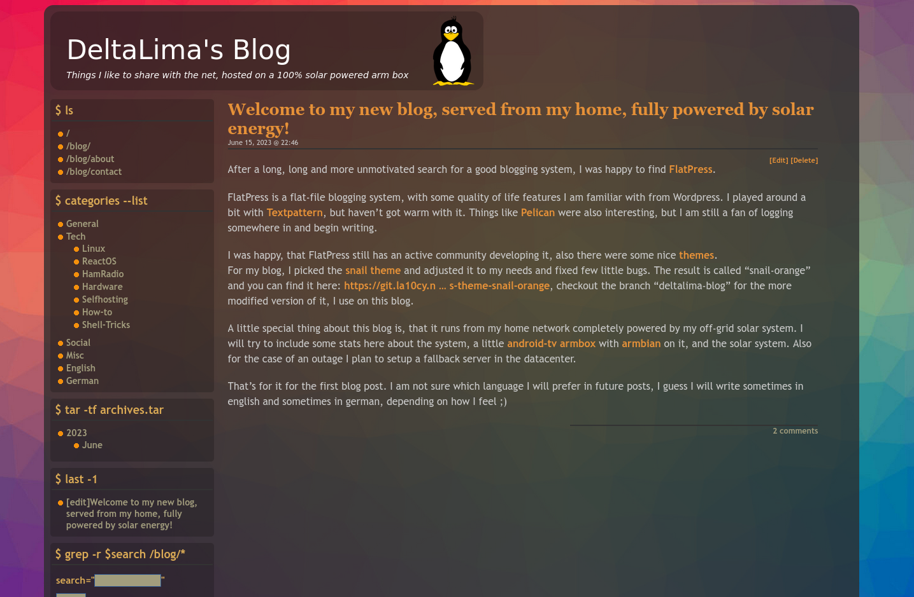

# flatpress-theme-snail-orange

# this theme is now seperated into an own one! see the "rainbow" at its new location: [https://git.la10cy.net/DeltaLima/flatpress-theme-rainbow]

this gets not maintained!

snail theme for flatpress but in orange color, transparent, rounded corners, colorful background image i stole from https://websitesetup.org/bootstrap-tutorial-for-beginners/ :)

forked from https://wiki.flatpress.org/res:themes:snail

this branch contains the theme with customizations for my blog https://deltalima.org/blog/

